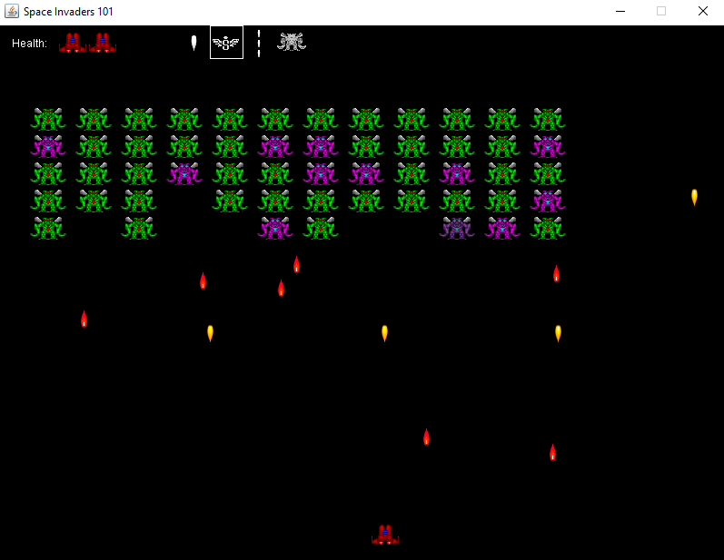

# java-invaders
Remixed Space Invaders Game made with Java AWT (original code by [cokeandcode.com](https://www.cokeandcode.com/)).

## Requirements
A Java Development Kit (JDK), version 8 or higher

## Running the game
From a console window pointed at the root of the project run the "gradlew run" command.

If you run into

`ERROR: JAVA_HOME is not set and no 'java' command could be found in your PATH.`

Go into your environment variables. Make sure to create a JAVA_HOME system variable that directs to your JDK install directory. Then add the binaries in this directory to your PATH 

## Controls
Left Arrow/A - Move left

Right Arrow/D - Move right

Spacebar - Shoot

1, 2, 3, 4 - Select weapon 1-4

ESC - Quit

## Changes

- Added WASD movement
- Added harder enemy
    - takes 2 shots to kill
    - shoots bullets towards the player
    - changes sprites when damaged as visual feedback
- Added player health system and health bar at the top
- Added invinsibility frames (with shield visual feedback)
- Added 3 new weapons
    - Spread shot
    - Rapid fire
    - Alien fire
- Added weapon select interface at the top

## Notes
Tutorial: [Space Invaders 101: An Accelerated Java 2D Tutorial](http://www.cokeandcode.com/info/tut2d.html)

Building a Gradle project: https://docs.gradle.org/current/samples/sample_building_java_applications.html
